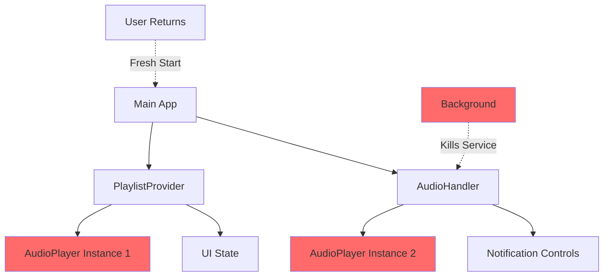
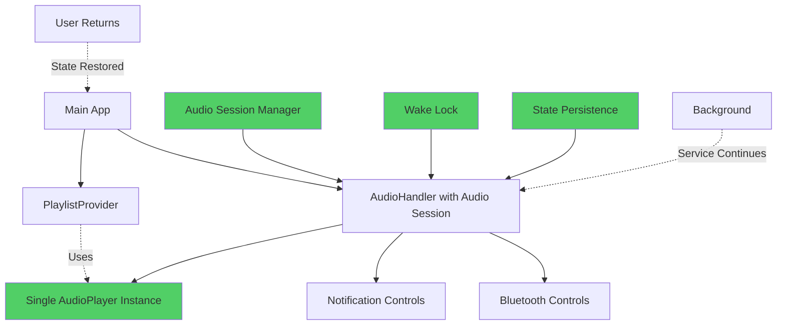
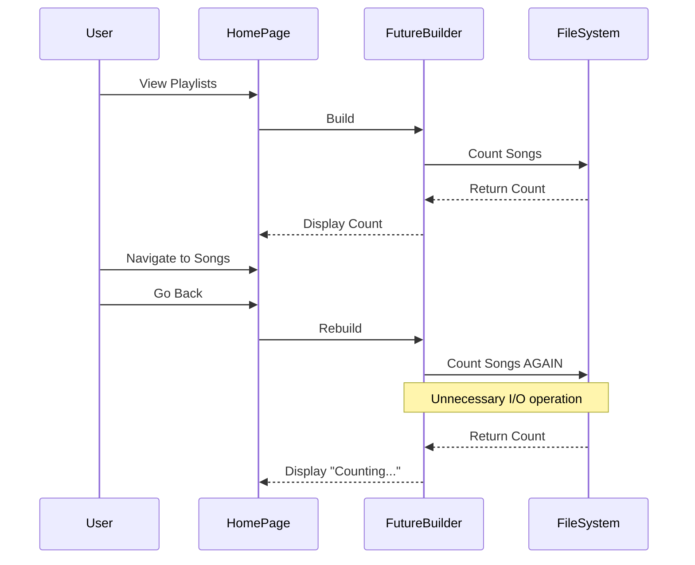
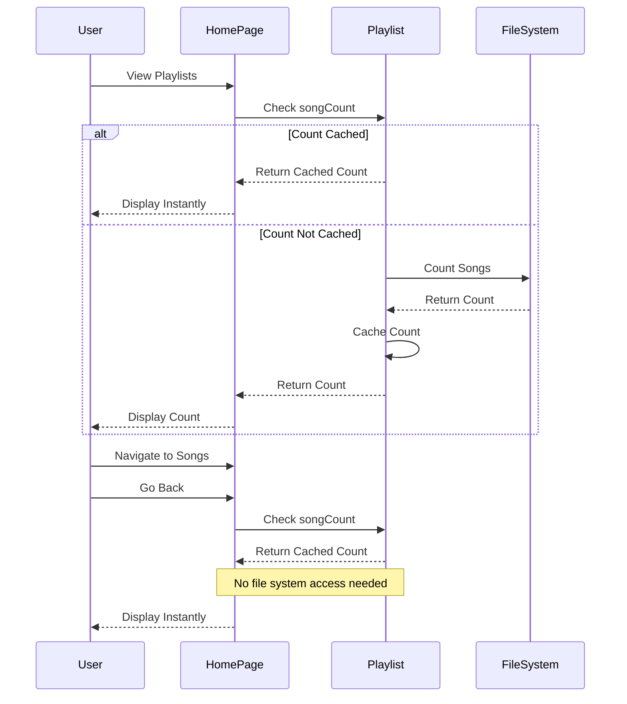
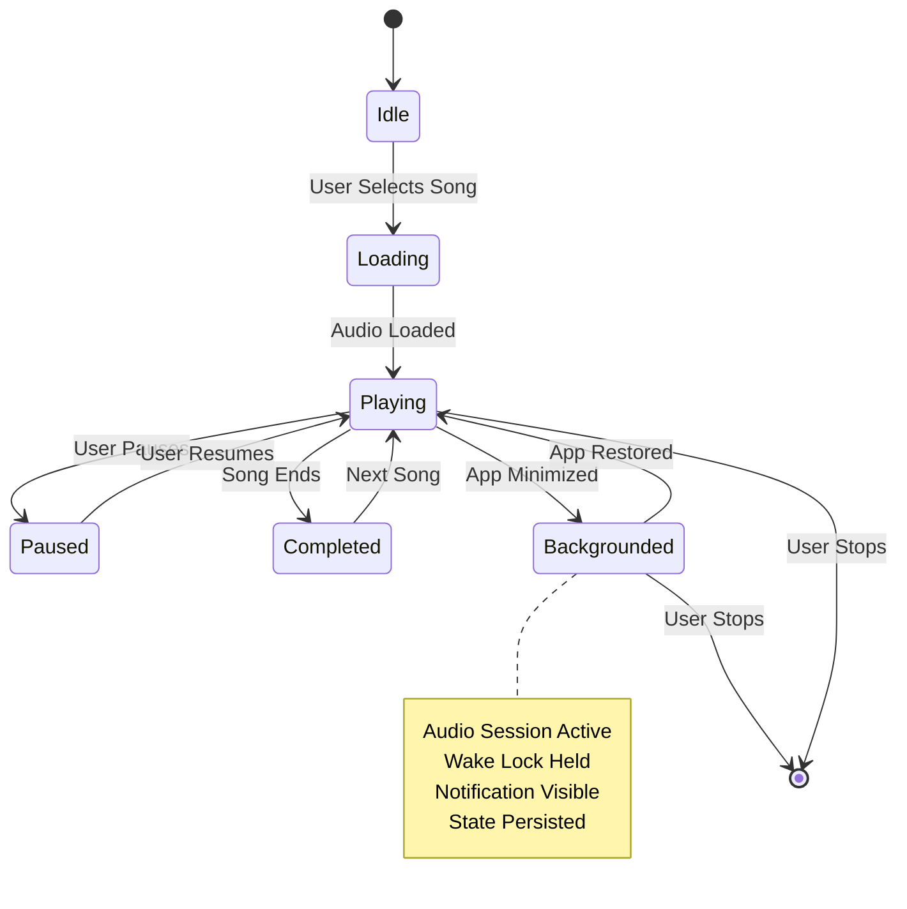
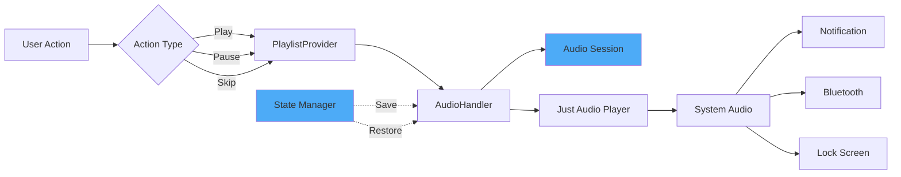

# Music Player Architecture - Before & After

## Current Architecture (Problematic)

**Problems:**
- Two separate AudioPlayer instances causing conflicts
- No audio session management
- Service gets killed in background
- State not persisted

## New Architecture (Fixed)

**Improvements:**
- Single AudioPlayer instance managed by AudioHandler
- Proper audio session configuration
- Wake lock keeps service alive
- State persistence for seamless restoration

## Song Count Caching Flow

### Before (Inefficient)

### After (Optimized)

## Background Playback State Machine

## Component Interaction Flow

## Key Improvements Summary

1. **Single Source of Truth**: One AudioPlayer instance in AudioHandler
2. **Proper Session Management**: Audio session configured for background playback
3. **State Persistence**: Playback state saved and restored
4. **Efficient Caching**: Song counts cached in memory
5. **Lifecycle Awareness**: Proper handling of app lifecycle events
6. **Resource Management**: Wake lock and audio focus properly managed